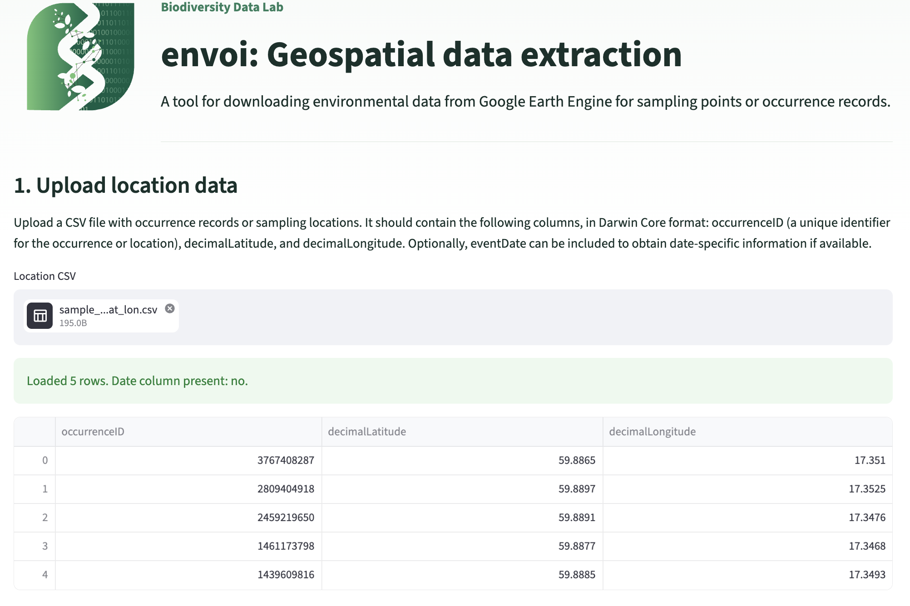

# envoi

[](https://pypi.org/project/envoi-geospatial/)
[](https://pypi.org/project/envoi-geospatial/)
[](https://github.com/BiodiversityDataLab/envoi/blob/main/LICENSE)
[](https://doi.org/10.5281/zenodo.22144753)

Automated feature extraction from environmental data sources for ecological and spatial analysis.

---

## Table of contents

- [Install](#install)
- [Earth Engine setup](#earth-engine-setup)
- [Quick start](#quick-start)
  - [Walkthrough](#walkthrough)
- [Browser-based user interface](#browser-based-user-interface)
  - [Using the web app](#using-the-web-app)
  - [Hosted web app](#hosted-web-app)
  - [Local web app](#local-web-app)
- [Outputs](#outputs)
  - [Tabular](#tabular)
  - [Raster](#raster)
- [Advanced usage](#advanced-usage)
- [Reference](#reference)
  - [Built-in datasets](#built-in-datasets)
  - [Notes](#notes)
- [How to cite](#how-to-cite)
- [Contributors](#contributors)
- [Project links](#project-links)

---

## envoi - ENvironmental Variables for Observational Instances

Ecological and spatial models need environmental variables attached to field sample points — climate, terrain, land cover, vegetation indices. The usual workflow involves stitching together one-off scripts for each data source (Earth Engine for satellite data, rasterio for local files, ad-hoc projections to get distances right), and the outputs rarely line up.

envoi exposes a single `extract(df, config)` call that runs against both Google Earth Engine and local GeoTIFFs and returns the same shape of output. No pre-downloading, sensible defaults for users who'd rather not think about CRS or UTM zones, and the same reducers and QC columns across data sources so results are directly comparable.

envoi is developed at the [Biodiversity Data Lab](https://biodiversity.se/) at Uppsala University.

---

## Install

```bash
pip install envoi-geospatial
```

Requires Python 3.10 or newer.

---

## Earth Engine setup

Datasets that come from Google Earth Engine (most of the built-in catalog — `dem_copernicus_glo30`, `ndvi_landsat_annual`, etc.) need a service account key from Google. If you only plan to use your own local rasters you can skip this section.

**Step 1 — get the key file.** In the [Google Cloud Console](https://console.cloud.google.com/iam-admin/serviceaccounts), create a service account that has Earth Engine access and download its JSON key. You'll end up with a file like `my-project-1234-abcdef.json`. See the [official guide](https://developers.google.com/earth-engine/guides/service_account) for the full walkthrough.

**Step 2 — put the file somewhere envoi can find it.** Pick whichever of these is easiest:

- **In your project folder:** save it as `credentials/ee_credentials.json` next to your script or notebook. This is the simplest option if you only use Earth Engine for one project.
- **In your user folder:** save it as `~/.config/envoi/ee_credentials.json` (macOS/Linux) or `%APPDATA%\envoi\ee_credentials.json` (Windows). You may need to create the folder. Useful if you want the same key available to every project on your computer.
- **At a custom path via environment variable:** set `ENVOI_EE_CREDENTIALS` to the file's path. envoi checks this before the two folders above, so it's the right choice when the key lives outside the defaults, when you swap between several credential files, or in CI / Docker.
- **Anywhere else:** pass the path explicitly in your code before calling `extract()`:

  ```python
  from envoi import init_gee

  init_gee(credentials_path="/path/to/my-project-1234-abcdef.json")
  ```

- **Without a file:** if the key comes from a secret store or another program, pass its content with `credentials_json`. It accepts the JSON text (`str` or `bytes`) or a `dict`. With `credentials_json`, `init_gee()` does not look for a key file. Pass `credentials_path` or `credentials_json`, not both.

  ```python
  init_gee(credentials_json=key_text)
  ```

---

## Quick start

Pass any DataFrame with an identifier column and a latitude/longitude pair. By default envoi expects the GBIF / Darwin Core names `occurrenceID`, `decimalLatitude`, `decimalLongitude` and treats coordinates as WGS84 (EPSG:4326). If yours differ, override on the call with `id_column=`, `latitude_column=`, `longitude_column=`, and `input_crs=` (e.g. `"EPSG:32634"`) — envoi reprojects to WGS84 internally. An optional `eventDate` column (or any column passed via `date_column=`) enables [date-aware extraction](https://github.com/BiodiversityDataLab/envoi/blob/main/docs/advanced_usage.md#date-aware-extraction).

```python
import pandas as pd
from envoi import extract

sample_points = pd.DataFrame({
    "occurrenceID":     ["a", "b", "c"],
    "decimalLatitude":  [59.85, 59.86, 59.87],
    "decimalLongitude": [17.63, 17.64, 17.65],
})

# Single output: mean and std of elevation in a 200 m window around each point.
outputs = extract(sample_points, {
    "batch_id": "terrain",
    "datasets": ["dem_copernicus_glo30"],
    "settings": {
        "output_type": "tabular",
        "statistics": ["mean", "std"],
        "window_size_m": 200,
    },
})

# Files land in outputs/ by default:
#   outputs/terrain.csv               ← reducer columns
#   outputs/terrain_qc.csv            ← per-point coverage / nodata flags
#   outputs/terrain_metadata.json     ← per-run dataset metadata
```

Override the output location with `extract(df, config, output_dir="my_dir")`.

The same config can also live in a YAML file — see [examples/run.yml](https://github.com/BiodiversityDataLab/envoi/blob/main/examples/run.yml) for a runnable template.

### Walkthrough

For a guided end-to-end tutorial — tabular and raster extraction, local rasters, multi-dataset runs, date-aware extraction, and catalog discovery — see the [walkthrough notebook](https://github.com/BiodiversityDataLab/envoi/blob/main/examples/walkthrough.ipynb).

---

## Browser-based user interface

envoi also includes a web app for users who prefer to work in a browser instead of writing Python code. You can use the web app in two ways:

- **Hosted web app:** a public web app on [SciLifeLab Serve](https://serve.scilifelab.se/). You need only a web browser and an Earth Engine key. The hosted web app is not online yet. Its address will be added here when it is available.
- **Local web app:** you install envoi and run the web app on your own computer. Use it for larger runs, or when you want the results written straight into a folder on your computer.



### Using the web app

You need:

- a CSV file with your points, with the same GBIF / Darwin Core columns as the Python API: `occurrenceID`, `decimalLatitude`, `decimalLongitude`, and optionally `eventDate`,
- a Google Earth Engine service account JSON key. Step 1 of [Earth Engine setup](#earth-engine-setup) tells you how to get one. You upload the key file in the web app, so you do not need to save it in a special folder.

The page has five steps:

1. Upload the CSV file. If your coordinates are not in WGS84 (EPSG:4326), choose "Other EPSG" and enter the EPSG code.
2. Upload the service account key.
3. In the local web app, choose the output directory. The hosted web app has no output directory, because you download the results.
4. Add one row for each data product. In each row, choose the output type: **Tabular** gives statistics for each point (see [Tabular](#tabular)), and **Raster** gives one GeoTIFF tile for each point (see [Raster](#raster)). One run can contain both tabular and raster rows. The **Category** list filters the data products by theme.
5. Click **Extract selected data**.

While the extraction runs, the page shows a progress bar and a **Cancel** button. The progress and the results stay on the page when you change other settings. **Clear results** removes them from the page.

Each data-product row becomes one batch with the name `extract_<row number>_<data product>`, for example `extract_01_dem_copernicus_glo30`. The output files have the names and the folder layout that [Outputs](#outputs) describes.

**Run log.** Each extraction also writes a run log next to the outputs. The run log is a text file with the start time of the extraction (UTC) in its name, for example `envoi-run-log-20261008T141500Z.txt`. It lists the warnings and errors that envoi reported during the extraction: for example rows without a date, dates that are not complete (such as a year only), points with low pixel coverage, and points for which Earth Engine returned an error. The page shows the number of warnings. When an extraction fails, the page also shows the last lines of the run log. A cancelled or stopped extraction has no run log.

### Hosted web app

The hosted web app runs on a server that many users share. It handles your key and your data as follows:

- **Your key** stays in the server's memory for your browser session only. The web app never writes it to disk. Each extraction runs in its own process on the server, and that process uses only your key.
- **Your points and the results** stay on the server's disk only while they are needed. The server deletes the results 10 minutes after your first click on **Download results**, or at the latest 30 minutes after the extraction ends. A new extraction or **Clear results** deletes them earlier. A failed, cancelled, or stopped extraction gives no results, and the server deletes its files when it ends. Like your key, the uploaded points file stays in the server's memory for your browser session, and the results contain the IDs and coordinates of your points.
- **A server restart** stops running extractions and deletes all results.

**Keep the page open and visible while an extraction runs.** The page asks the server for the status every 2 seconds. When no page asks for 10 minutes, for example because you closed the tab or your computer went to sleep, the server stops the extraction. A page reload loses the link to a running extraction. If you then start an extraction with the same key, the web app offers **Cancel the earlier job**.

**Download.** When the extraction is complete, click **Download results**. You get one ZIP file, for example `envoi-results-20261008T141500Z.zip`, with all output files and the run log. You can download it again until the server deletes it. Your browser saves the file in its download folder. Most browsers can be set to ask where to save each download.

**Limits.** The hosted web app has these limits. They are starting values and can change, and the web app always shows the limits that apply.

| What                         | Limit                                                                                                         |
| ---------------------------- | ------------------------------------------------------------------------------------------------------------- |
| CSV file                     | 50 MB, and 10,000 data rows                                                                                   |
| Data-product rows            | 10 per extraction                                                                                             |
| Tabular rows                 | Windows up to 10,000 m. Points × window sizes up to 20,000 over all tabular rows (**Point** counts as one window size). |
| Raster rows                  | Windows up to 2,000 m. Points × window sizes up to 1,000 tiles over all raster rows.                          |
| Run time                     | 60 minutes per extraction                                                                                     |
| Size of the results          | 1 GB per extraction                                                                                           |
| Extractions at the same time | One per page and one per key. The server also runs only a few extractions at the same time (2 by default).   |

The web app checks the file, the rows, and the windows before an extraction starts, and tells you what to change. It stops an extraction that runs longer than the run time, or whose results grow larger than the size limit, and you then get no results. Raster rows of data products with many bands give large results. When the server is busy, the web app asks you to try again in a few minutes.

For larger runs, or to write the results straight into a folder, use the [local web app](#local-web-app) or the Python package.

### Local web app

Install envoi with the optional web app dependencies:

```bash
pip install "envoi-geospatial[webapp]"
```

For local development from a cloned repository, install the package in editable mode:

```bash
pip install -e ".[webapp]"
```

Start the app:

```bash
envoi-webapp
```

Then open the local URL printed by Streamlit, usually:

```text
http://localhost:8501
```

The local web app runs only on your own computer. It has no limits, except one running extraction per page. It writes the results into the output directory that you choose in step 3 (default: `envoi_outputs` in your home folder), and the page shows the paths of the output files and the run log. Like the hosted web app, it keeps your key in memory only and runs each extraction in a separate process.

**Cancel** stops the extraction. Files that the extraction wrote before you clicked **Cancel** stay in the output directory. They can be incomplete, so check or delete them before you use them.

---

## Outputs

### Tabular

`output_type: "tabular"` produces a table with one row per input point and one column per reducer × dataset × window. A separate QC file flags coverage and nodata.

**Reducer columns** look like: `dem_copernicus_glo30_mean_200m`, `dem_copernicus_glo30_std_200m`.

**QC columns** look like: `dem_copernicus_glo30_in_extent_200m`, `dem_copernicus_glo30_n_pixels_200m`, `dem_copernicus_glo30_had_nodata_200m`, `dem_copernicus_glo30_coverage_pct_200m`.

**Available reducers:**

- Core stats: `mean`, `median`, `min`, `max`, `sum`, `std`, `var`, `count`, `mode`
- Quantiles: `q05`, `q10`, `q25`, `q50`, `q75`, `q90`, `q95`
- Categorical: `class_count`, `class_fraction` (expanded per-class downstream)
- Special: `point` — samples the exact pixel at each coordinate (no window)

For the current authoritative list, run:

```python
from envoi import list_reducers
list_reducers()
```

**Output file format.** Set `output_file_format` in the settings block:

| Value         | Result                                                   |
| ------------- | -------------------------------------------------------- |
| `"csv"`       | `outputs/<batch_id>.csv` (default)                       |
| `"parquet"`   | `outputs/<batch_id>.parquet`                             |
| `"dataframe"` | Returns the DataFrame in-memory, skips writing to disk.  |

```python
extract(sample_points, {
    "batch_id": "terrain",
    "datasets": ["dem_copernicus_glo30"],
    "settings": {
        "output_type": "tabular",
        "statistics": ["mean"],
        "window_size_m": 200,
        "output_file_format": "csv",
    },
})
```

### Raster

`output_type: "raster"` exports a GeoTIFF tile per point, cropped to the requested window:

```python
extract(sample_points, {
    "batch_id": "terrain_tiles",
    "datasets": ["dem_copernicus_glo30"],
    "settings": {
        "output_type": "raster",
        "window_size_m": 200,
        "resample_m": 10,   # optional — resample all tiles to a common resolution
    },
})
```

Tiles land at `outputs/<batch_id>/<dataset>/<id>-<dataset>.tif`.

**Without `resample_m`,** tiles are written in the source raster's native CRS at native resolution. The tile boundary snaps to the source pixel grid, so the actual extent is `window_size_m` rounded to whole pixels — any pixel touched by the requested window is included, and tile dimensions can vary slightly across points (especially for global datasets where pixel size depends on latitude).

**With `resample_m`,** every tile is reprojected to the point's UTM zone at exactly `resample_m` meters per pixel, on a grid snapped to that resolution. All tiles end up the same size (`round(window_size_m / resample_m)` pixels per side) and are spatially aligned across data sources — useful when feeding tiles to a CNN that expects a fixed input size or when comparing GEE and local rasters pixel-for-pixel.

---

## Advanced usage

Multiple outputs in one call, date-aware extraction, mixing categorical and continuous datasets, per-call band selection, multiple window sizes, and custom dataset registration are covered in [docs/advanced_usage.md](https://github.com/BiodiversityDataLab/envoi/blob/main/docs/advanced_usage.md). A starter custom catalog (local raster and Earth Engine entries) lives at [examples/catalog.yml](https://github.com/BiodiversityDataLab/envoi/blob/main/examples/catalog.yml).

---

## Reference

### Built-in datasets

envoi ships with a curated set of Earth Engine datasets spanning terrain, climate, land cover, satellite imagery, vegetation indices, and human-impact themes.

**📖 [Browse the full dataset reference → docs/datasets.md](https://github.com/BiodiversityDataLab/envoi/blob/main/docs/datasets.md)** — every built-in dataset grouped by theme, with resolution, temporal coverage, bands, licence, and citation.

To inspect the catalog from Python — including any datasets you've registered with `update_catalog()`:

```python
from envoi import list_datasets, catalog_markdown

list_datasets()          # just the names
list_datasets("info")    # name + display name, description, citation, source URLs
list_datasets("full")    # the complete catalog entry for each dataset

print(catalog_markdown())  # the same reference document as Markdown text
```

`list_datasets()` returns its result (a list of strings for the default call, of dicts for `"info"` / `"full"`) rather than printing, so you can filter and process it in code. In a Jupyter notebook, render the Markdown version instead of reading raw dicts:

```python
from IPython.display import Markdown, display
from envoi import catalog_markdown

display(Markdown(catalog_markdown()))
```

A representative subset of the built-in catalog:

- **Terrain** — `dem_copernicus_glo30`
- **Climate** — `climate_worldclim_v1_bioclim`, `climate_era5_monthly`, `climate_terraclimate_monthly`
- **Land cover** — `lulc_worldcover_2021`, `lulc_copernicus_lc100`, `lulc_naturallands_2020`
- **Satellite imagery** — `sr_landsat_8day`, `sr_landsat_32day`, `sr_landsat_annual`
- **Vegetation / productivity** — `ndvi_landsat_annual`, `evi_landsat_annual`, `npp_modis_terra`, `agb_esa_cci`
- **Human impact** — `human_impact_index` plus eight `hii_driver_*` subcomponents
- **Embeddings** — `aef_satellite_embeddings`

The machine-readable source, including descriptions, citations, and URLs for every entry, is [src/envoi/configs/ee_catalog.yml](https://github.com/BiodiversityDataLab/envoi/blob/main/src/envoi/configs/ee_catalog.yml).

### Notes

- **Input CRS.** Coordinates in the input DataFrame are assumed to be in **WGS84 (EPSG:4326)**. If yours are in a different CRS, pass `input_crs="EPSG:XXXX"` to `extract()` and envoi reprojects them to WGS84 before extraction.
- **Window units.** `window_size_m` is in meters. Each window is projected into the point's local UTM zone so distances are correct globally.
- **Data source CRS and resolution.** Both are detected automatically from each dataset — no manual configuration needed.
- **QC, not failure.** Low pixel coverage is flagged in QC columns rather than raising. Filter on `<dataset>_coverage_pct_<window>m` to drop unreliable rows downstream.

---

## How to cite

A paper describing envoi is currently in preparation. In the meantime, please cite the software directly:

> Baggström, A., Nyström, J., & Andermann, T. (2026). *envoi: automated environmental feature extraction for ecological analysis* [Computer software]. Zenodo. https://doi.org/10.5281/zenodo.22144753

```bibtex
@software{envoi,
  author = {Baggström, Adrian and Nyström, Jakob and Andermann, Tobias},
  title  = {envoi: automated environmental feature extraction for ecological analysis},
  year   = {2026},
  doi    = {10.5281/zenodo.22144753},
  url    = {https://doi.org/10.5281/zenodo.22144753}
}
```

That DOI covers **all versions** and always resolves to the most recent release. If your analysis needs to be reproducible against the exact version you ran, cite that release's own DOI instead — every release is archived separately, and they're listed under "Versions" on the [Zenodo record](https://doi.org/10.5281/zenodo.22144753).

Citation metadata is maintained in [CITATION.cff](https://github.com/BiodiversityDataLab/envoi/blob/main/CITATION.cff) — the **"Cite this repository"** button in the GitHub sidebar generates an up-to-date entry in APA or BibTeX.

The paper citation will be added here once it is published.

---

## Contributors

**Primary authors and maintainers** — Adrian Baggström, Jakob Nyström.

**Past contributors** — Miguel Redondo at [NBIS](https://nbis.se); Shaheryar, Thant Zin Bo, and Per Vincent Ankarbåge (Uppsala University Data Science MSc students).

**Acknowledgements** — Tobias Andermann (Conceptualization and PhD supervision for A.B. and J.N.). A.B., J.N., and T.A. received financial support from the SciLifeLab & Wallenberg Data Driven Life Science Program (grant: KAW 2020.0239) and from the Swedish Research Council (2023-05366). We are grateful to the maintainers of Google Earth Engine, rasterio, geopandas, and pyproj.


---

## Project links

- **License** — [MIT](https://github.com/BiodiversityDataLab/envoi/blob/main/LICENSE)
- **Contributing** — [CONTRIBUTING.md](https://github.com/BiodiversityDataLab/envoi/blob/main/CONTRIBUTING.md)
- **Issues / bug reports** — [github.com/BiodiversityDataLab/envoi/issues](https://github.com/BiodiversityDataLab/envoi/issues)
- **Repository** — [github.com/BiodiversityDataLab/envoi](https://github.com/BiodiversityDataLab/envoi)

---

*Take these points: cross sky and stone;  
return them clothed, no longer alone.*
